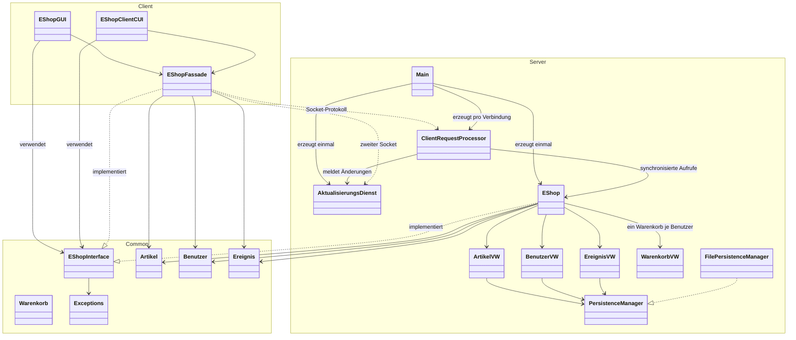
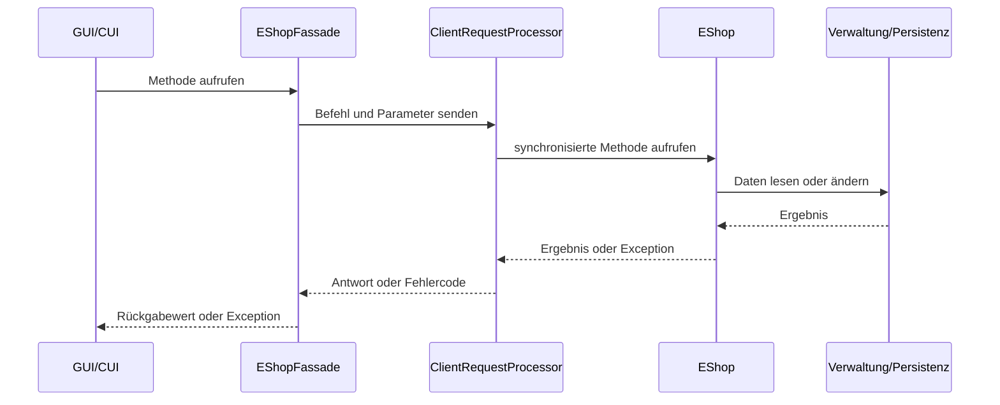

# UML-Modell der Client/Server-Version

Das Modell zeigt die für Aufgabe 4 relevante Aufteilung des eShops. Bereits
vorhandene Detailklassen der GUI und Persistenz sind zusammengefasst, damit die
Verteilung auf Client, Common und Server erkennbar bleibt.

## Ablauf einer Client-Anfrage

`Main` nimmt Verbindungen an. Für jede Verbindung läuft ein eigener
`ClientRequestProcessor`-Thread. Alle Prozessoren verwenden denselben
Anwendungskern, synchronisieren dessen Aufrufe und führen getrennte Warenkörbe
pro angemeldetem Benutzer beziehungsweise pro nicht angemeldeter Sitzung. Ein
gemeinsamer `AktualisierungsDienst` verteilt Änderungen über separate
Benachrichtigungsverbindungen an die anderen Clients.
